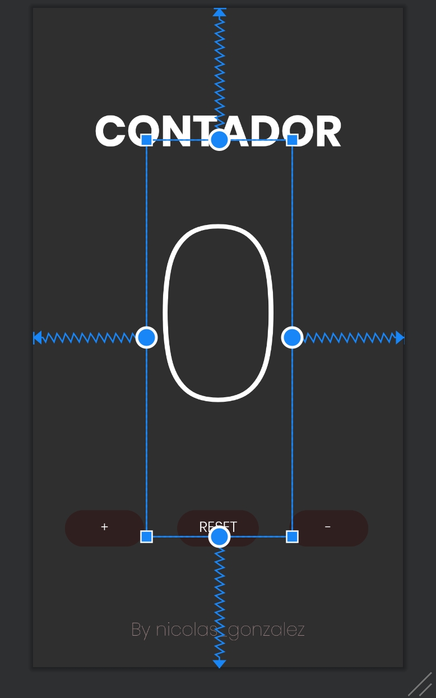
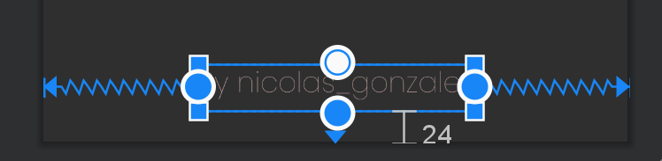
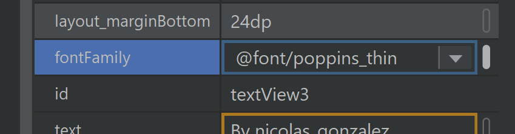
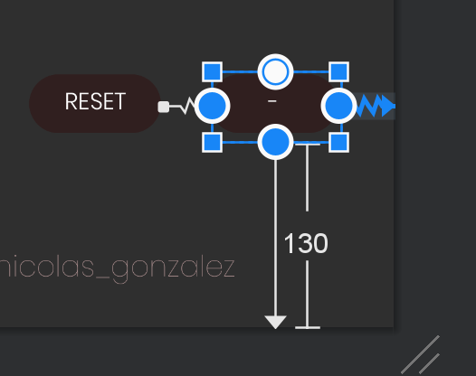
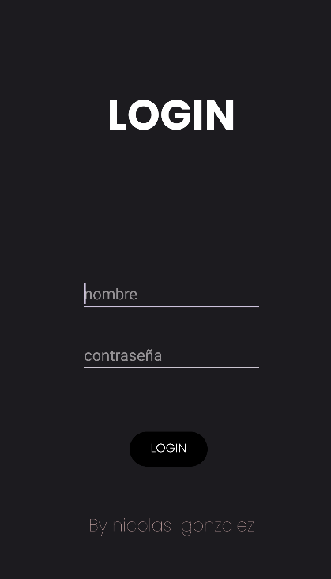
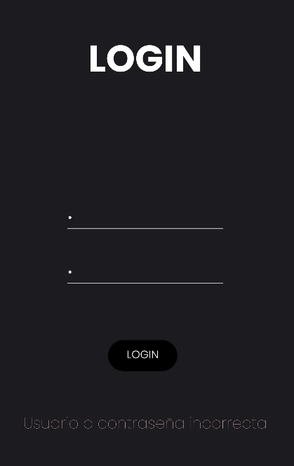
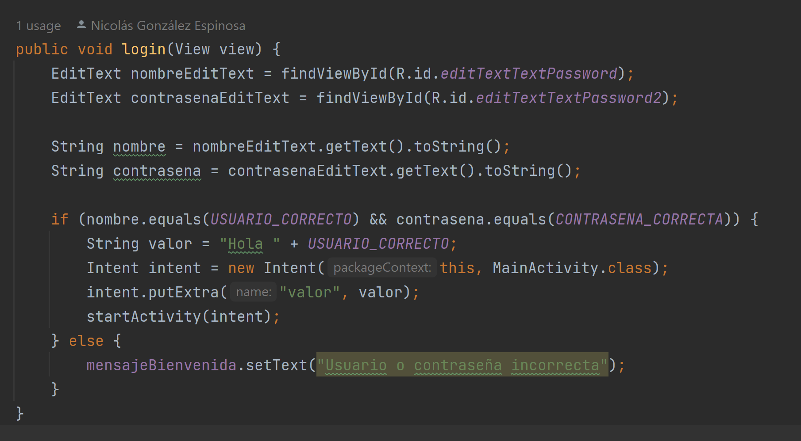

Proyecto de Interfaz en Android Studio - Ejercicio 1

Deberás recrear en android la aplicación del contador que se os proporciona. El diseño se os pasará por figma (abajo teneis el enlace). En este primer ejercicio solo debes hacer la parte visual, nada de lógica. Asegurate de que el resultado final sea identico al proporcionado, en tu criterio queda elegir el o los tipos de layouts que utilizarás. Mediante figma obtén el tipo de fuente, colores etc que debes utilizar en tu aplicación.

Lo primero a entender en Android Studio es a fijar un elemento según los límites de la pantalla. 

También se puede especificar los píxeles a los que estará determinado elemento. 

Es importante personalizar los textos mediante la pestaña Attributes, en la que cambiar el tamaño, fuente, color...

Proyecto de Login en Android Studio - Ejercicio 2

Crea la segunda pantalla en el mismo proyecto(investiga como). Deberás realizar un lógin tal y como se muestra en el figma, en el caso de que el usuario y contraseña sean admin en el TextView de abajo saldrá “Usuario y contraseña correcta” en caso contrario “Usuario o contraseña incorrecta”. Investigar por vuestra cuenta como iniciar la aplicación en la Activity login. Pista → se configura en el AndroidManifest.xml. Una vez que iniciemos el login deberá pasar a la pantalla del contador pasando el dato del nombre del usuario (aparecerá en la parte baja de la pantalla de contador donde ponía “by nombre_alumno”).(ACTUALIZADO)

Añado la pantalla login, desde la que se accederá al contador. EditTextTextPassword fue bastante útil, así como los ya conocidos Constrain para poner cada cosa en su sitio. 

Recalco, que al tener un nombre o contraseña erróneo, se ve reflejado en la aplicación. 

Esta es la parte que más lógica tiene, las palabras clave: intent y StartActivity serán muy importantes en el desarrollo Android. Así que debo tenerlas en cuenta. 

